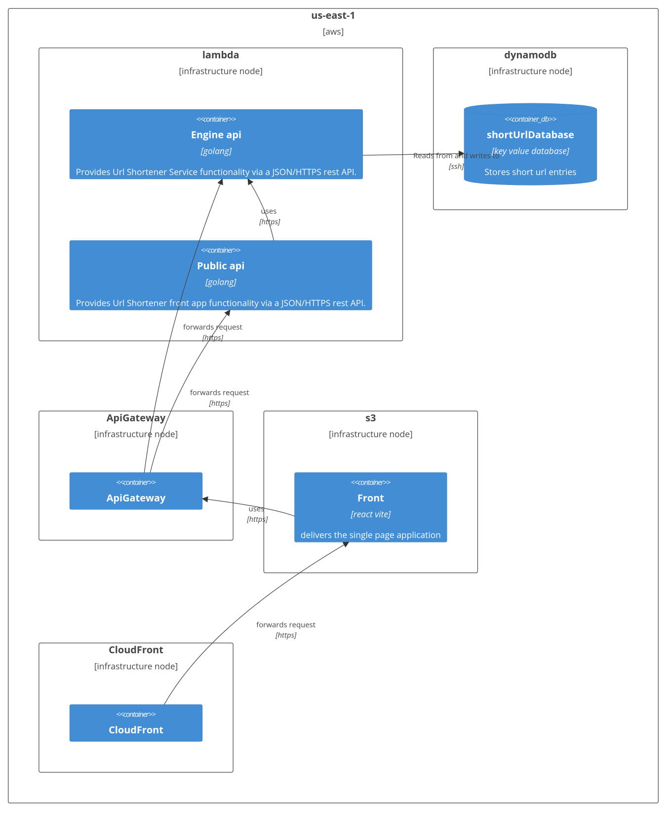
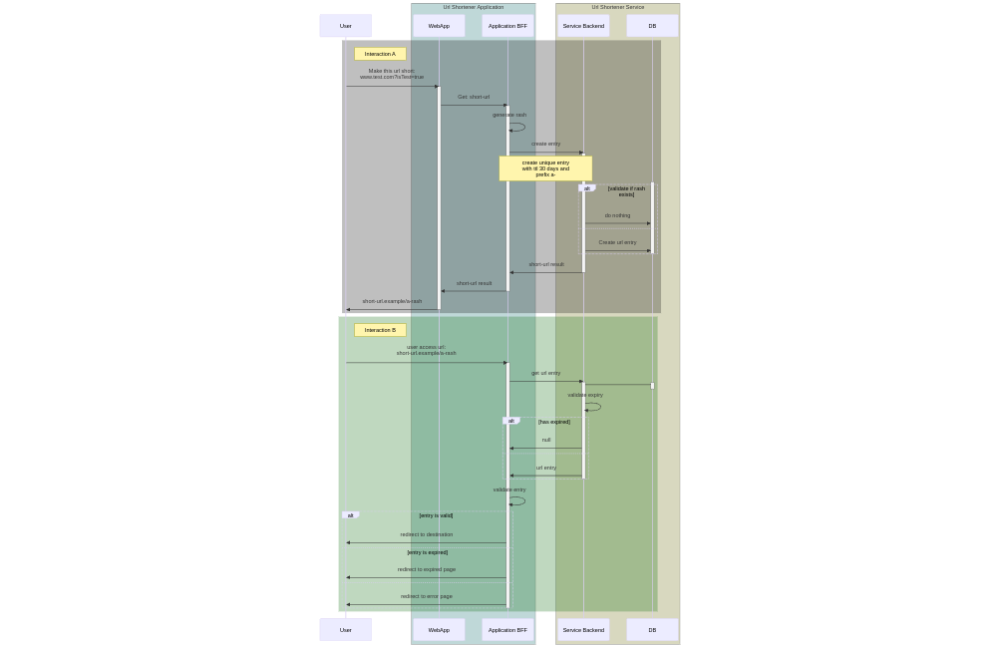
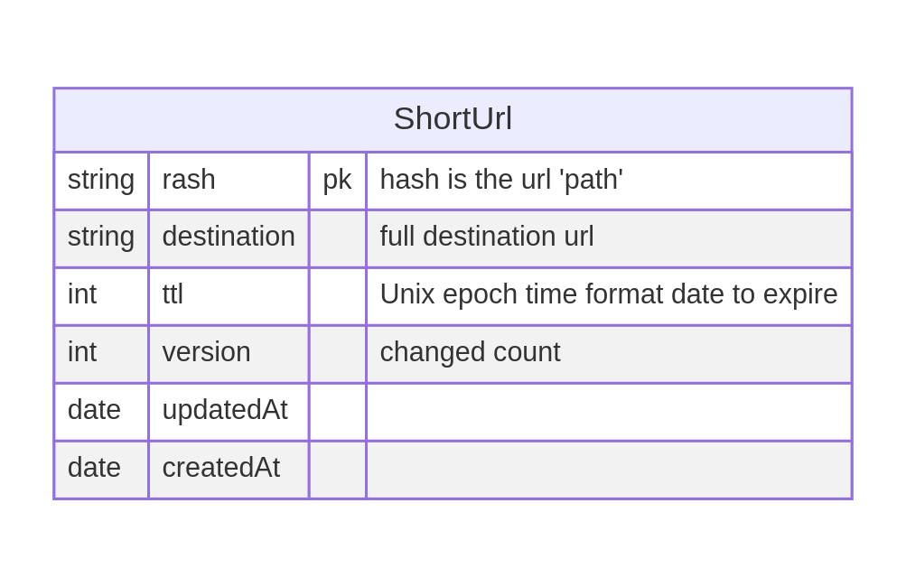
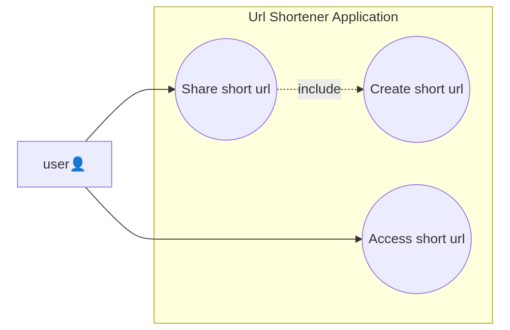
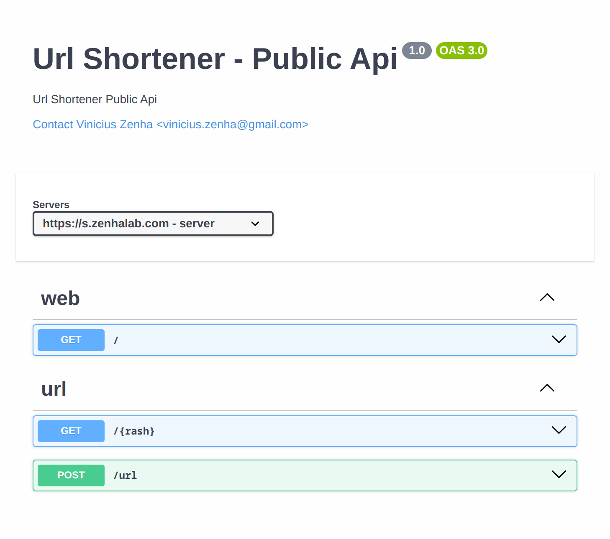
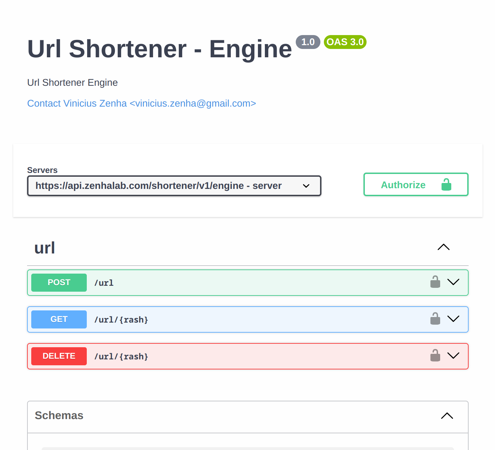

# Shortener

Deploy your own shortener service in the aws free tier. Made in Go with minimal dependencies. Raw HTML JS and _tailwind_ front. Main engine to integrate with other internal services.

## Features 📃

-   Fully serverless pay per request
-   Terraform infra
-   Github actions
-   Generic main engine
    -   Easily integrate using a api-key
-   Bff implementation example

### Requirements 🛠️

-   make
-   aws-cli
-   terraform
-   go
-   node
-   yarn

## Setup 🦩

Make sure to have all requirements.

1. Clone the repo
1. Install node dependencies with `yarn install`
1. Copy `.env.example` to `.env.dev` and `.env.prod` and fill the values
    > Some values only exist after running Terraform apply
2. Configure your runner in `nx.json tasksRunnerOptions`
2. Configure or remove the `terraform remoteBackend bucket` in each environment
3. Deploy with `nx run shortener:deploy:dev` and `nx run shortener:deploy:prod`

> Work in progress...

## Usage ☃️

As this project uses nx you can see all available commands with `nx show projects` then `nx show project {projectName}`

> Work in progress...

## Architecture 🎨

See in [/docs](/docs)

|                    |                    |
| -------------------------------------------------------------------------------------------------------------------- | ---------------------------------------------------------------------------------------------------------------------- |
|                 |                 |
|                     |                     |

