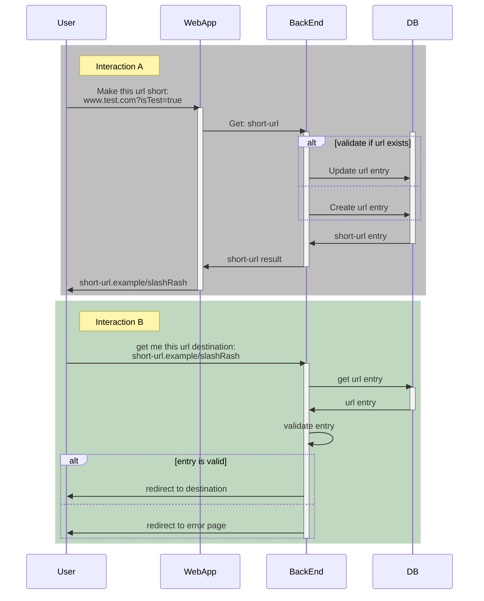

```mermaid
sequenceDiagram

participant u as User
participant w as WebApp
participant b as BackEnd
participant d as DB
rect rgba(0,0,0,0.25)
note right of u: Interaction A
    u->>w: Make this url short:<br/> www.test.com?isTest=true
    activate w
    w->>b: Get: short-url
    activate b
    activate d
    alt validate if url exists
        b->>d: Update url entry
    else
        b->>d: Create url entry
    end
    d->>b: short-url entry
    deactivate d
    b->>w: short-url result
    deactivate b
    w->>u: short-url.example/slashRash
    deactivate w
end
rect rgba(0,100,0,0.25)
note right of u: Interaction B
    u->>b: get me this url destination:<br/>short-url.example/slashRash
    activate b
    b->>d: get url entry
    activate d
    d->>b: url entry
    deactivate d
    b->>b: validate entry
    alt entry is valid
        b->>u: redirect to destination
    else
        b->>u: redirect to error page
    end
    deactivate b
end
```