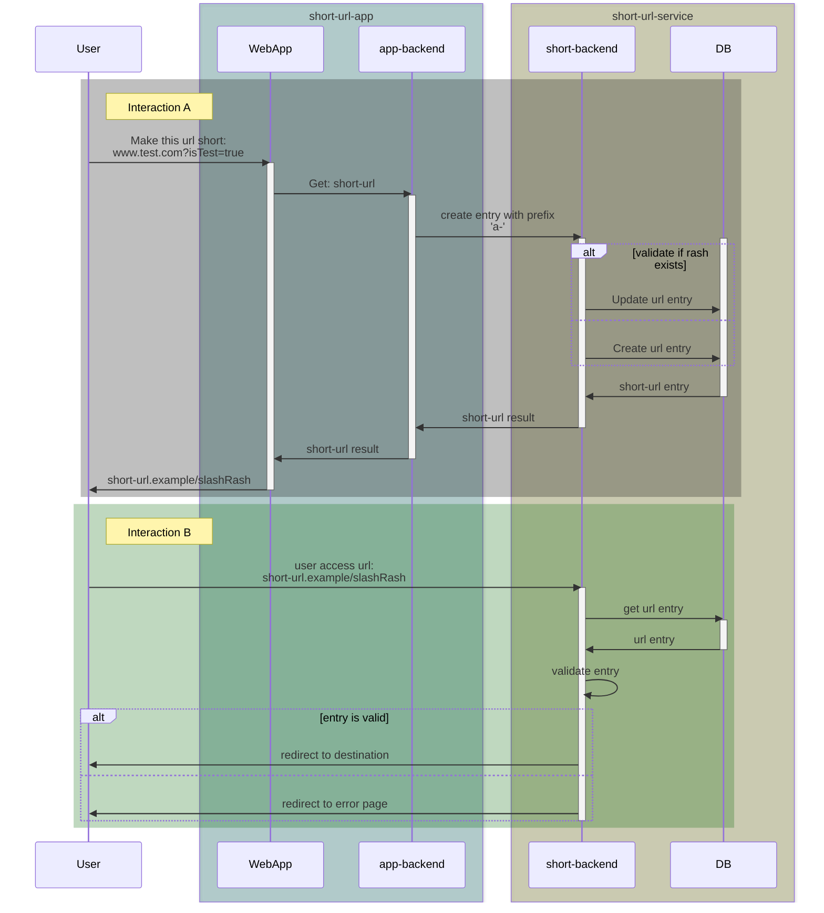

```mermaid
sequenceDiagram

participant u as User
box rgba(0,100,100,0.25) short-url-app
participant w as WebApp
participant b as app-backend
end
box rgba(100,100,0,0.25) short-url-service
participant s as short-backend
participant d as DB
end
rect rgba(0,0,0,0.25)
note right of u: Interaction A
    u->>w: Make this url short:<br/> www.test.com?isTest=true
    activate w
    w->>b: Get: short-url
    activate b
    b->>s: create entry with prefix<br/>'a-'
    activate s
    activate d
    alt validate if rash exists
        s->>d: Update url entry
    else
        s->>d: Create url entry
    end
    d->>s: short-url entry
    deactivate d
    s->>b: short-url result
    deactivate s
    b->>w: short-url result
    deactivate b
    w->>u: short-url.example/slashRash
    deactivate w
end
rect rgba(0,100,0,0.25)
note right of u: Interaction B
    u->>s: user access url:<br/>short-url.example/slashRash
    activate s
    s->>d: get url entry
    activate d
    d->>s: url entry
    deactivate d
    s->>s: validate entry
    alt entry is valid
        s->>u: redirect to destination
    else
        s->>u: redirect to error page
    end
    deactivate s
end
```