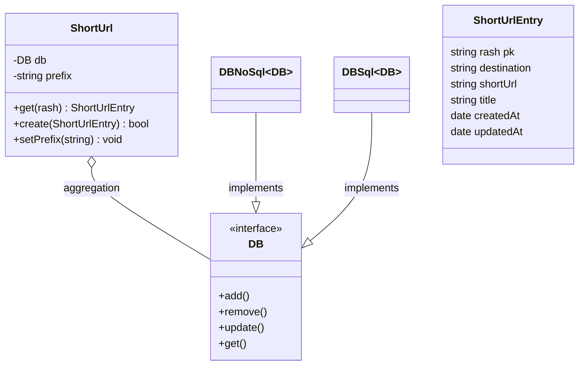

```mermaid
classDiagram
    class ShortUrl {
        -DB db
        -string prefix
        +get(rash) ShortUrlEntry
        +create(ShortUrlEntry) bool
        +setPrefix(string) void
    }

    class DB {
        <<interface>>
        +add()
        +remove()
        +update()
        +get()
    }

    class DBNoSql~DB~ {

    }
    class DBSql~DB~ {

    }

    class  ShortUrlEntry{
        string rash pk
        string destination
        string shortUrl
        string title
        date createdAt
        date updatedAt
    }

    ShortUrl o-- DB : aggregation
    DBNoSql --|> DB : implements
    DBSql --|> DB : implements
```