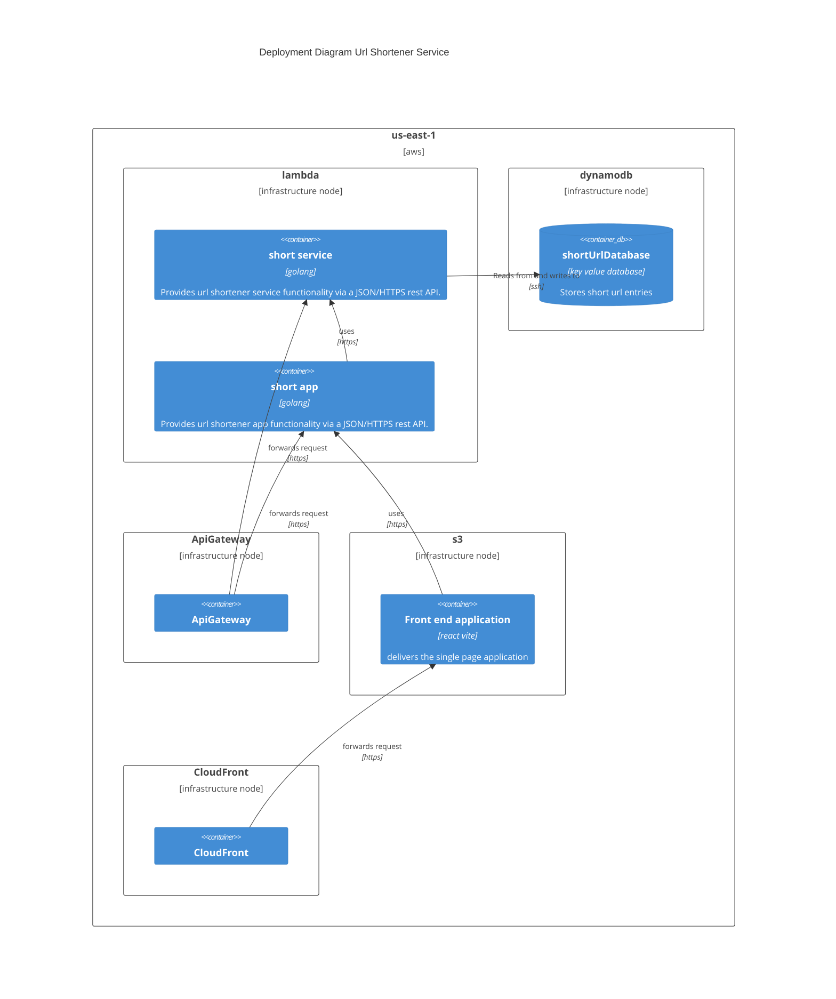

```mermaid
C4Deployment

title Deployment Diagram Url Shortener Service

Deployment_Node(aws, "us-east-1", "aws"){

    Deployment_Node(lambda, "lambda", "infrastructure node"){
        Container(sservice, "short service", "golang", "Provides url shortener service functionality via a JSON/HTTPS rest API.")
        Container(sapp, "short app", "golang", "Provides url shortener app functionality via a JSON/HTTPS rest API.")
    }
    Deployment_Node(dynamo, "dynamodb", "infrastructure node"){
            ContainerDb(db, "shortUrlDatabase", "key value database", "Stores short url entries")
    }


    Deployment_Node(apigateway, "ApiGateway", "infrastructure node"){
            Container(apigatewayN, "ApiGateway")
    }
    Deployment_Node(s3, "s3", "infrastructure node"){
        Container(frontend, "Front end application", "react vite", "delivers the single page application")
    }
    Deployment_Node(cloudfront, "CloudFront", "infrastructure node"){
            Container(cloudfront, "CloudFront")
    }
}


Rel(sservice, db, "Reads from and writes to", "ssh")
Rel(frontend, sapp, "uses", "https")
Rel(cloudfront, frontend, "forwards request", "https")
Rel(sapp, sservice, "uses", "https")
Rel(apigatewayN, sapp, "forwards request", "https")
Rel(apigatewayN, sservice, "forwards request", "https")

```