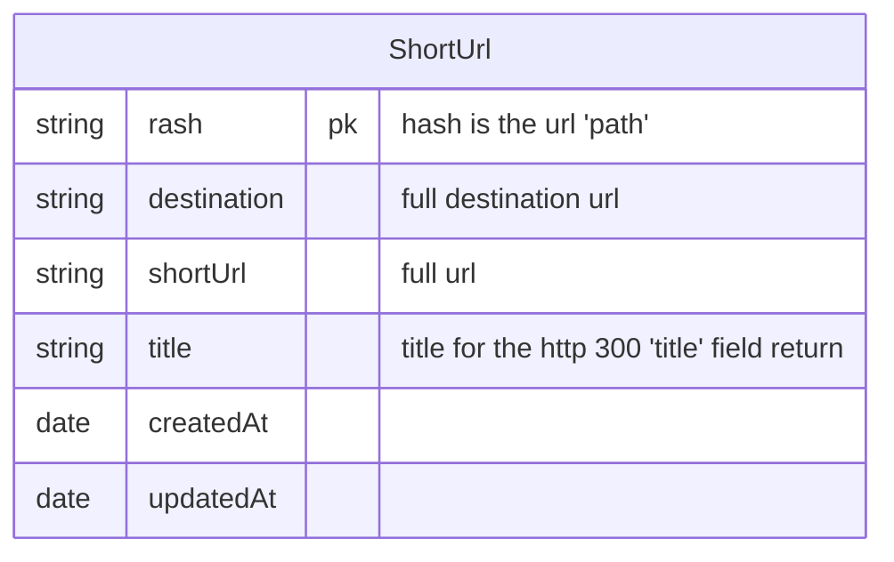

```mermaid
erDiagram
    ShortUrl {
        string rash pk "hash is the url 'path' "
        string destination "full destination url"
        string shortUrl "full url"
        string title "title for the http 300 'title' field return"
        date createdAt
        date updatedAt
    }
```