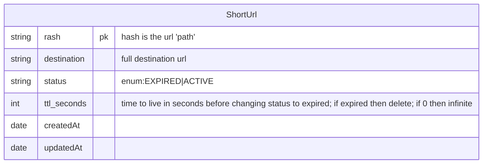

```mermaid
erDiagram
    ShortUrl {
        string rash pk "hash is the url 'path' "
        string destination "full destination url"
        string status "enum:EXPIRED|ACTIVE"
        int ttl_seconds "time to live in seconds before changing status to expired; if expired then delete; if 0 then infinite"
        date createdAt
        date updatedAt
    }
```