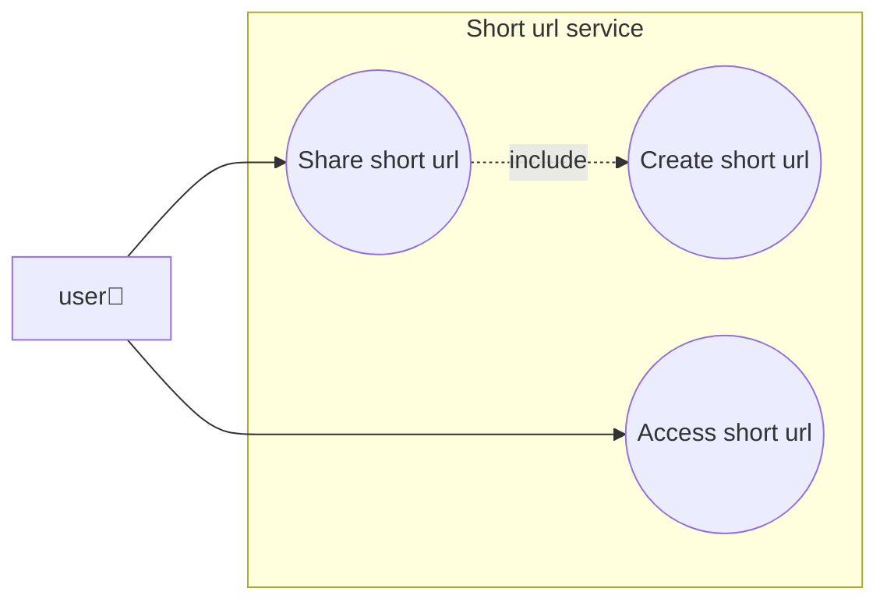

```mermaid
flowchart LR
    subgraph Short url service
    uc1((Share short url))
    uc2((Create short url))
    uc3((Access short url))
    end

    user[user👤]

    user-->uc1
    user--->uc3
    uc1 -. include .-> uc2
```