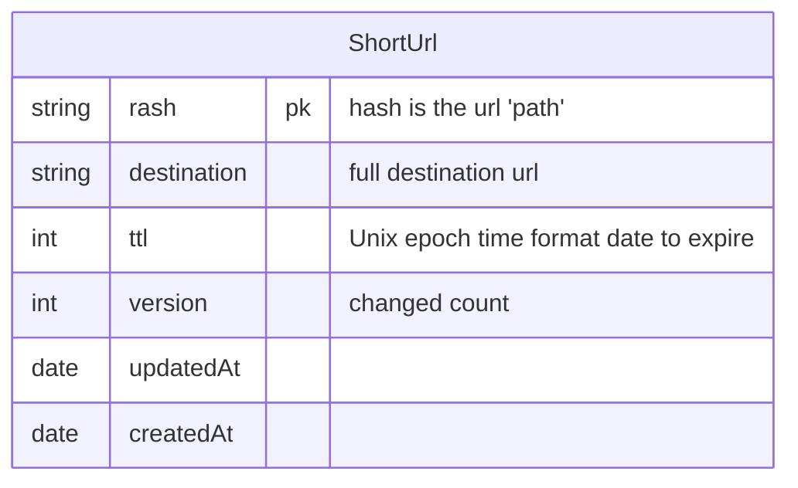

```mermaid
erDiagram
    ShortUrl {
        string rash pk "hash is the url 'path' "
        string destination "full destination url"
        int ttl "Unix epoch time format date to expire"
        int version "changed count"
        date updatedAt
        date createdAt
    }
```