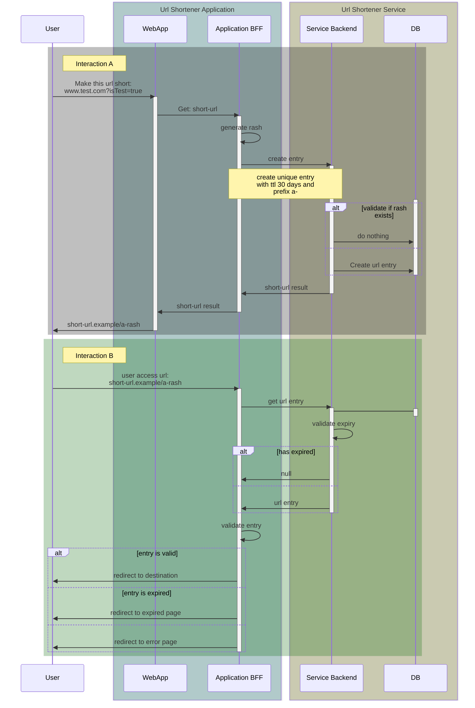

```mermaid
sequenceDiagram

participant u as User
box rgba(0,100,100,0.25) Url Shortener Application
participant w as WebApp
participant b as Application BFF
end
box rgba(100,100,0,0.25) Url Shortener Service
participant s as Service Backend
participant d as DB
end
rect rgba(0,0,0,0.25)
note right of u: Interaction A
    u->>w: Make this url short:<br/> www.test.com?isTest=true
    activate w
    w->>b: Get: short-url
    activate b
    b->>b: generate rash
    b->>s: create entry
    activate s
    note over s,b: create unique entry<br/>with ttl 30 days and<br/>prefix a-
    activate d
    alt validate if rash exists
        s->>d: do nothing
    else
        s->>d: Create url entry
    end
    deactivate d
    s->>b: short-url result
    deactivate s
    b->>w: short-url result
    deactivate b
    w->>u: short-url.example/a-rash
    deactivate w
end
rect rgba(0,100,0,0.25)
note right of u: Interaction B
    u->>b: user access url:<br/>short-url.example/a-rash
    activate b
    b->>s: get url entry
    activate s
    activate d
    s->d: 
    deactivate d
    s->>s: validate expiry
    alt has expired
        s->>b: null
    else
        s->>b: url entry
    end
    deactivate s
    b->>b: validate entry
    alt entry is valid
        b->>u: redirect to destination
    else entry is expired
        b->>u: redirect to expired page
    else
        b->>u: redirect to error page
    end
    deactivate b
end
```